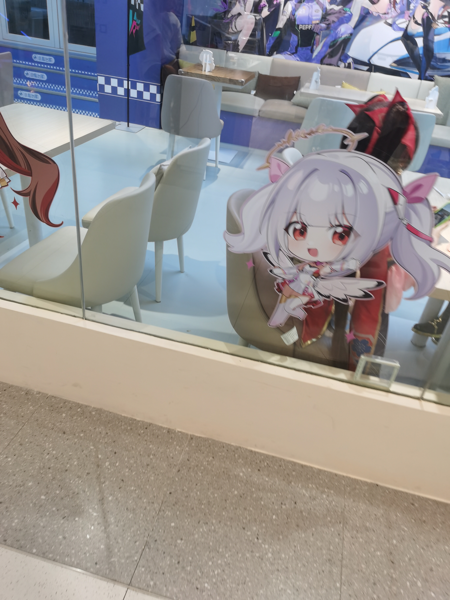
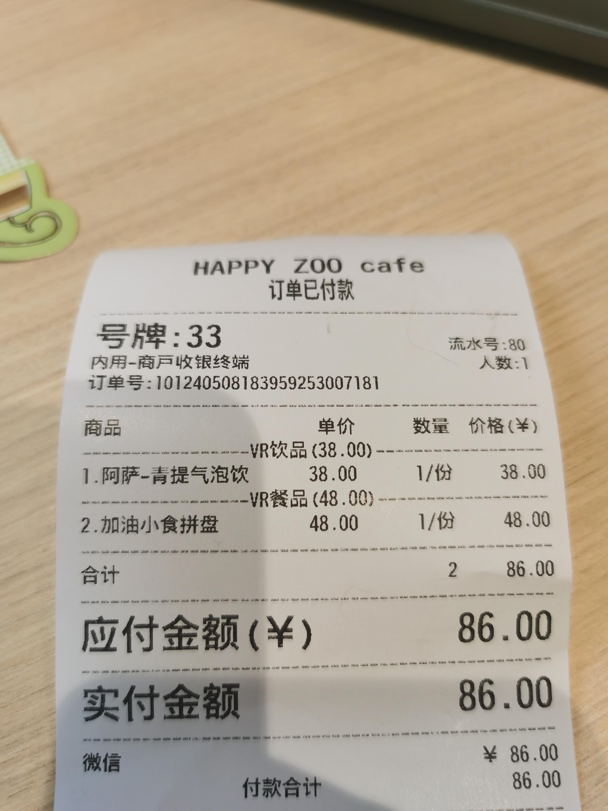
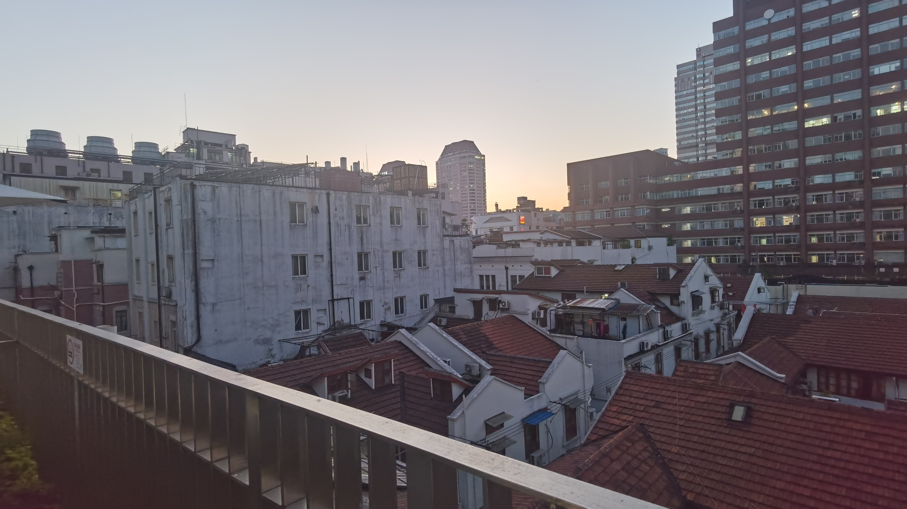
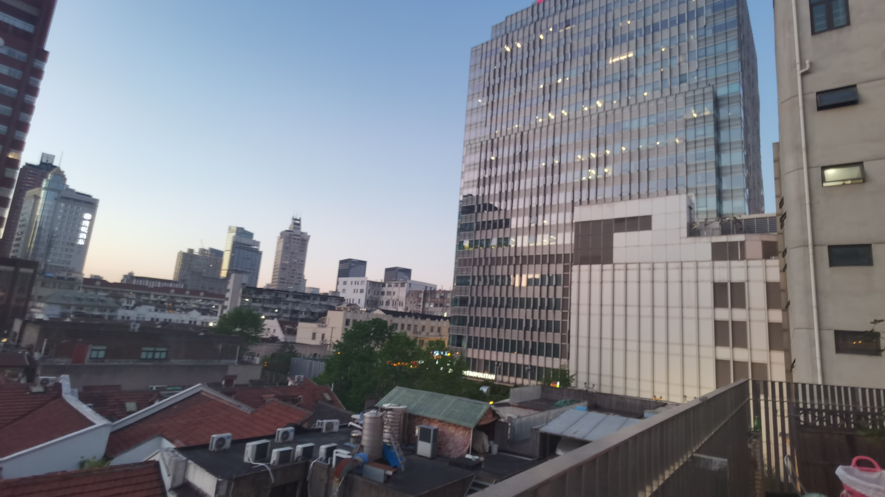
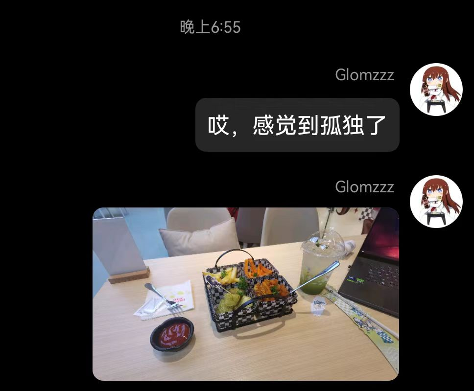
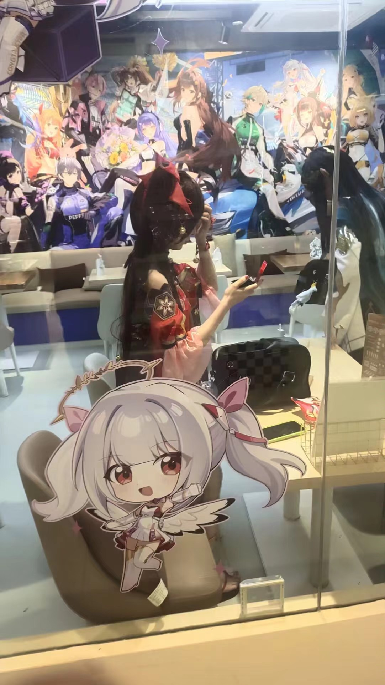
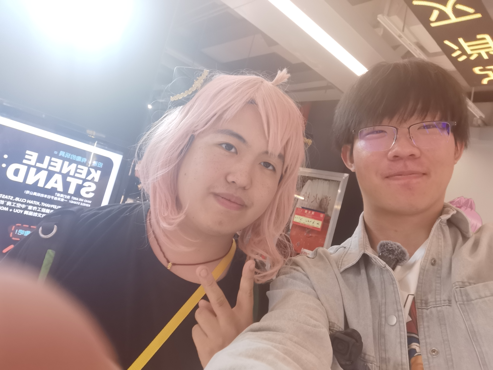
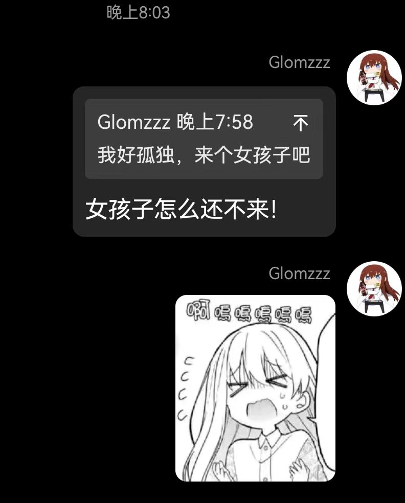
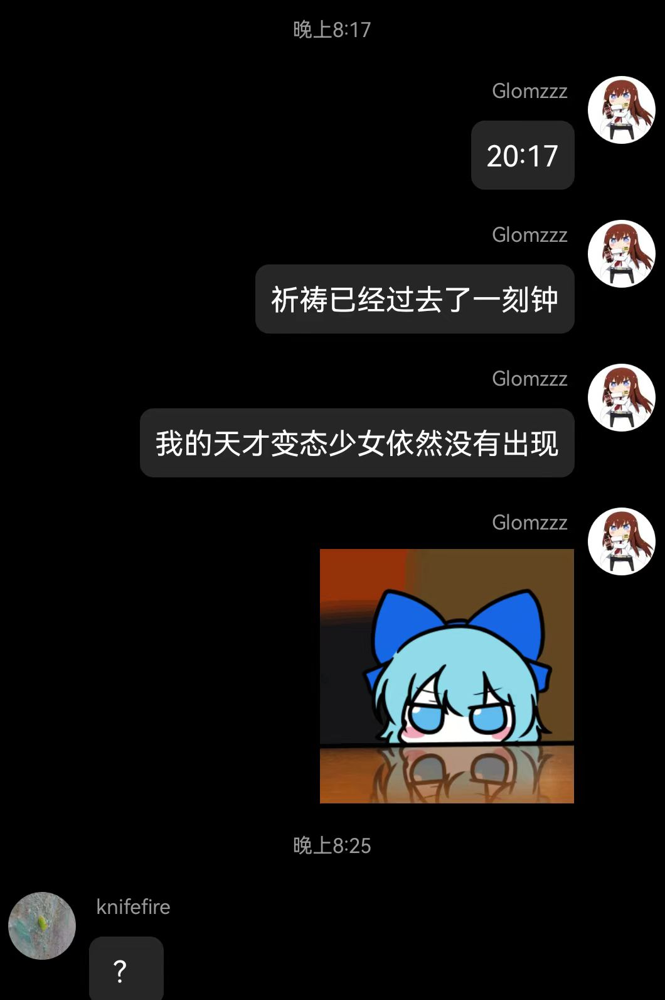
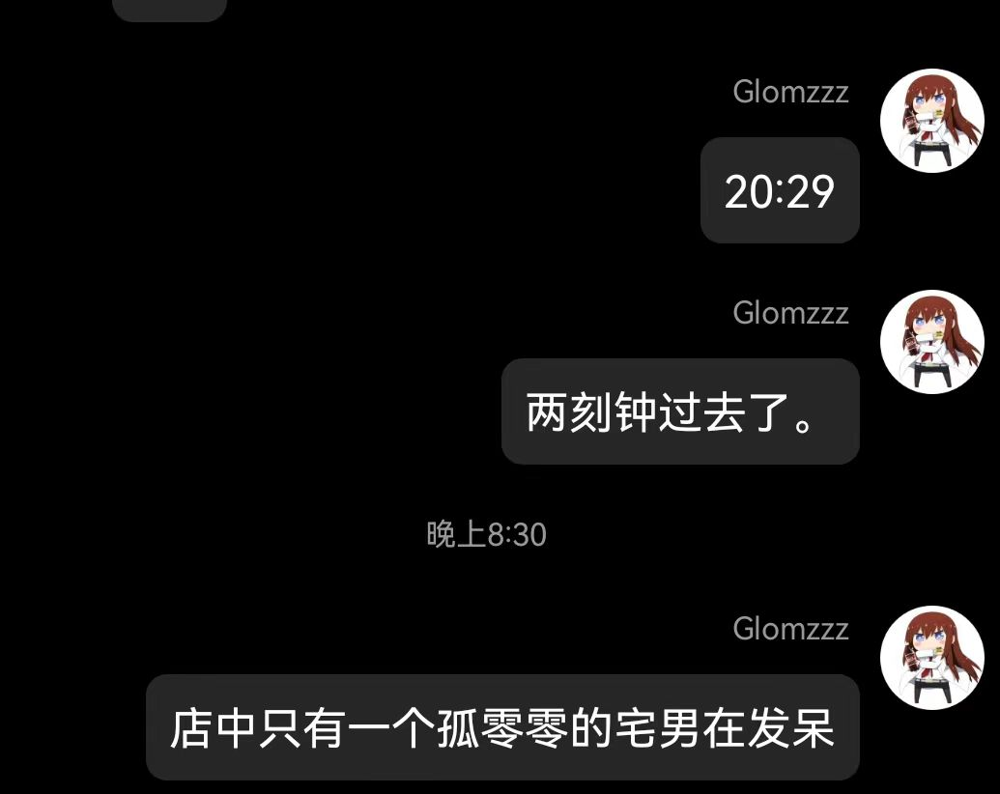

# 做出改变的一天

## 宅！
早上九点醒来后，我懒爬在床上提issue和修bug，不知不觉到了下午五点

我意识到已经宅在屋内100多个小时了，是时候出去走走晒晒阳光缓解一下尸斑了（笑）

## 可爱的花火

> 本篇在某二次元餐厅编写
> 应该是叫 HAPPY ZOO CAFE 没错

我在咖啡店门外瞄到了一只可爱的花火，于是偷偷拍下来一张（雾，我好猥琐哦）

（有点慌，没拍好，于是我准备进店找机会鼓起勇气集邮。）

哎进店就要消费的说，虽然我并不是很饿的说。

在待餐之余为了缓解尴尬我走上阳台拍了两张美照：这里是上海市中心的市中心啊。

好，我坐在花火后面，拿出笔记本假装认真工作。

我仍在犹豫何时能鼓起勇气去找姐姐集邮，但我始终迈不出那一步
看着店内孤零零的肥宅，我顿感十分孤独。

就在我刚感慨完“我感觉到孤独”了的时候：一位与我身高相仿的二次元，举起他的手机，在刚才和我相同的位置，以相同猥琐的姿态拍照花火。
清欣赏：

我们俩相视一笑，他就闯进来了（为什么他不用消费啊？？！！）

并且他还带着他那位来自浙江绍兴的朋友。
下文称这位人兄为寒哥，他朋友为钱叔。（没办法我年龄实在是太小了！）

我与他们交谈甚欢，可惜寒哥让我鼓起勇气去找花火集邮的时候她们已经离开力！（悲！！）

寒哥有事出去了一会，期间我开始与钱叔交谈，在聊到我们都是战地一玩家时，我们不约而同地握了一下手

于是我们促膝长谈，从单机游戏聊到世界历史，再从西方哲学聊到时事政治。

哎，我已经数不清我们握过多少次手了。

以下是我们大概的交谈内容：
- steam游戏：战地1 战地5，Fallout，无人深空
- 二游：吐槽赛马娘手游（我同学也这么说
- 哲学：分享哲学书，他给我看了他的那俩本很老的《哲学术语解释》，我给他分享了一下我看的《大问题：哲学导论》
- 历史：分享一些up主，小约翰可汗，稚嫩的魔法师是我们都看的，然后他给我推荐森纳映画，巧合的是，我前天刚看完他的那期丁立人与捏波的国际象棋决战。

聊得正兴起，门外走过一对 【Spy Family】，这时受寒哥鼓舞，我鼓起勇气去集邮！

（难绷，我为什么闭着眼睛呢？）

不久，寒哥与钱叔因为要赶飞机先行一步，道别时我们大喊：

⌈这一切都是命运石之门的选择！⌋

而后店内只剩下我一个人。

我不禁感慨我与这二位何其有缘，在他们要启程离开的最后几个小时见面，畅谈如此之欢。

⌊哎！现在还是好孤独啊！（想要女孩子）⌉

我们日常生活的点点滴滴就是奇迹呢。

也许我不该总宅在家里，而该多出来走走了（？）

> 那么我的女孩子呢？！怎么还没来啊？ ( 21:00 )

## 记一次黑心理发店

从楼上下来后，我走在南京路步行街上，

当时我正与朋友视频通话，聊着刚才发生的趣事。

我本想走进苹果店看看做完刚出的ipad pro，这时我被一个理发店老板拉到4楼。

最后强买强卖爆了我很多金币。

为了我的人身安全，我没有在店内与他们发生言语与肢体冲突，而是回到家。。。（见下篇）

